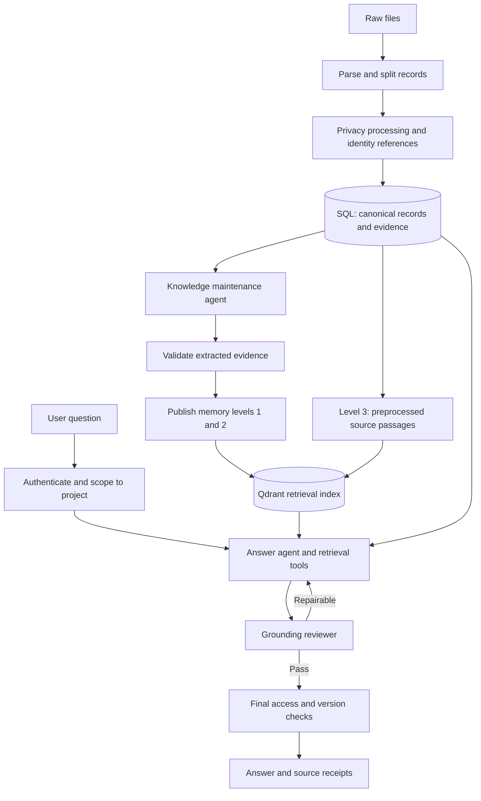

# AI agent workflow and architecture

**Status:** Proposed architecture for review; not an implementation.  
**Scope:** Document processing, three-level memory, agentic retrieval, grounding review, privacy, and project access.  
**Behavioral reference:** `production-behavior.md`. This document proposes implementation choices without changing that specification.

## 1. Architecture in one view

Use a controlled workflow with three agent roles:

1. **Knowledge maintenance agent:** extracts evidence-linked summaries and maintains them as documents arrive or change.
2. **Answer agent:** searches, follows evidence links, checks decision history, and drafts a grounded answer.
3. **Grounding reviewer:** independently checks the proposed claims against source passages before release.

These roles can use the same model with separate prompts and contexts. Separate models, autonomous agent conversations, and a general-purpose supervisor are not required. The application orchestrates their work and enforces permissions, version checks, retry limits, and deletion.

## 2. Storage responsibilities

Choose PostgreSQL as the canonical store. Qdrant is a rebuildable retrieval index, not the authority for document content, permissions, or decision status.

| Store or object | Responsibility |
| --- | --- |
| Project and membership tables | Project boundaries and user permissions |
| Original document | File identity, display title, upload/version metadata, activation state |
| Record | A single email, report, or transcript, linked to its original document |
| Record version and source spans | Canonical privacy-processed text with stable evidence locations |
| Identity mapping | Restricted mapping between project-scoped person IDs and names/contact details |
| Summary content and change notes | Narrative or bullet-point summaries and source-linked change notes; structured statements are optional |
| Memory artifacts | Level 1 descriptors and level 2 summaries, with dependencies and versions |
| Qdrant | Passage and summary retrieval candidates, with scope/version metadata |
| Jobs and change events | Processing state, summary rebuilds, stale flags, deletion progress |

All answerable data carries `project_id`. An original file can produce many records with the same `original_doc_id`. Each record retains its position in that original file, so splitting does not destroy provenance.

Suggested record fields:

- `record_id`, `original_doc_id`, `project_id`, `record_type`, `record_version`;
- `sent_at` or `meeting_at`, source timezone and date precision when known;
- `sender_person_id`, receiver IDs, attendee IDs, and customer organization where available;
- original source boundaries and a list of speaker/message/paragraph spans;
- references to the content stages below;
- processing status, active state, and publication generation.

Keep customer organizations distinct from individual people. Record unknown dates and uncertain identity matches explicitly instead of inventing values.

## 3. Ingestion and privacy workflow

### 3.1 Parse and split

A parsing worker identifies email boundaries, headers, transcript turns, and report boundaries. A model may assist with irregular layouts, but deterministic validation checks that boundaries belong to the input and that content was not silently lost.

Split bundled emails and email reports into separate records. Keep transcripts as records with addressable turns; chunk long transcripts later. Treat quoted emails as quoted history, not fresh agreements by the forwarding sender. Track duplicates so repeated copies do not become independent corroboration.

### 3.2 Content stages

| Stage | Meaning | Availability |
| --- | --- | --- |
| `raw_content` | Original parsed text | Restricted preprocessing access; excluded from RAG |
| `cleaned_content` | Personal residence addresses and non-work personal discussion removed, following the proposed ingestion policy | Restricted intermediate data |
| `privacy_marked_content` | Remaining names and contact information replaced by opaque person/contact references | Canonical input for summaries and indexing |
| `latest_privacy_secured_content` | Current published version after subsequent privacy changes | Source viewer and answer tools, through authorized rendering |

Prefer versioned content plus a current-version reference over four independently mutable text fields. If the team keeps the proposed column names, changes must update their versions and invalidate dependent artifacts together.

Removing personal-life discussion at ingestion is an additional proposal from the processing outline. It is separate from the agreed person-deletion scope of names and contact information. Preserve operational facts where possible: remove a private explanation without inventing a replacement explanation or discarding a supported availability date.

Use rules and an entity detector for candidate names/contact information, with model assistance for ambiguous context. Match aliases to project-scoped person IDs only when supported; two people with the same name must not be merged automatically. Quarantine uncertain records from publication if unresolved personal information could enter the index.

Opaque identifiers such as `PERSON_7Q2` are preferable to invented human names or role-based aliases: they avoid fabricating identities and encoding a role that may later change. The identity mapping supports consistent attribution across documents. Restrict name resolution to authorized application paths; normal retrieval tools do not expose the identity mapping.

The attached pseudonymization notes are design input, not an instruction to adopt their entire privacy scope. This design does not assume that deleting a mapping alone removes names from raw records or other copies. It also does not adopt quasi-identifier generalization or an HSM requirement as part of the current hackathon scope.

### 3.3 Publish only coherent versions

Processing proceeds through `received -> parsed -> privacy_ready -> extracted -> indexed -> published`, with an explicit failure state at each step.

Write canonical records and job state to SQL. Index asynchronously using repeatable jobs keyed by record version. Publish a generation only after its required artifacts are ready. Readers reject index candidates that do not match published SQL versions. This avoids requiring a distributed transaction between SQL and Qdrant.

## 4. Three levels of memory

These are persistent views of project evidence, not three increasingly authoritative sources of truth.

| Level | Content | Used for | Can independently support a final factual claim? |
| --- | --- | --- | --- |
| 1: discovery | Keywords, entities as IDs, short description of one or more sentences, dates, topic tags | Fast routing and broad discovery | No |
| 2: summarization | Suggestions, agreements, conclusions, to-dos, deferred decisions, and topic summaries | Finding relevant statements and tracing relationships | No; follow their source references |
| 3: evidence | Privacy-processed source text, headers, transcript turns, paragraph/message locations | Verifying claims and displaying receipts | Yes, where the passage actually supports the claim |

### 4.1 Level 2 can be prose or bullet points

Level 2 does not require a fixed statement schema. It can be a readable summary or lists of suggestions, agreements, conclusions, actions, and deferred decisions. Preserve relevant attribution, dates, conditions, and changes in the text when supported by the source.

Keep a small metadata envelope outside the prose: memory ID, project ID, parent record ID/version, covered chunk or source span IDs, and dependencies. This supports retrieval, citations, updates, and deletion without forcing every decision into predefined fields.

For example:

> The consultant proposed an October launch. The customer asked for a capacity check before agreeing. No acceptance is recorded in this meeting. [turns 12-16]

The more detailed statement fields previously proposed are an optional later optimization for deterministic filtering and visualization. They are not required for summarization or answering. Where later sections mention statements, a statement can be a passage in a summary linked to source evidence; a separate statement row is optional.

Mentioning a person does not make them an owner, and proposing something does not make them an agreeing party. A reported agreement is attributed to the reporting source; do not silently turn it into a direct acceptance by every attendee.

### 4.2 Maintaining a growing corpus

Do not repeatedly summarize the previous project summary plus the newest document. That accumulates omissions and makes mistakes difficult to reverse.

For each new or changed record:

1. Produce its level 1 descriptor and level 2 statements from level 3 evidence.
2. Validate source references and extract relevant topic/entity keys.
3. Retrieve potentially related existing statements, then compare only those candidates.
4. Propose supported change/correction links and unresolved-conflict flags.
5. Rebuild affected topic summaries from the underlying statements and source references.
6. Update the project overview from current topic summaries, retaining dependency links.
7. Publish the new artifacts and invalidate obsolete dependent versions.

Every summary records its input IDs/versions, generator version, and update time. A topic summary depends on its source records transitively. If any dependency becomes unavailable, the old summary is ineligible until rebuilt. Track rebuild state so the product does not present an outdated overview as complete.

Use periodic reconciliation to identify missed updates, orphaned indexes, and broken dependencies. New documents require local recomputation; they do not require summarizing the entire corpus every time.

## 5. Indexing and regular search

Never combine unrelated records in one chunk. Long records can have multiple chunks with bounded overlap and stable source span references. Store related person IDs in metadata, not their names or contact strings.

Suggested payload: `project_id`, `original_doc_id`, `record_id`, `record_version`, `chunk_id`, `span_ids`, `record_type`, dates, topic IDs, related person IDs, memory level, and publication generation.

Use Qdrant for retrieval. Each indexed chunk can carry its level 1 description, level 2 summary, and level 3 content, in that order. Memories may describe different portions of the same record; shared parent IDs preserve that relationship.

Retrieval has two steps:

1. Search Qdrant to identify candidate records through matching chunks or memories.
2. Group hits by parent record ID, then fetch all chunks belonging to each selected record/version in source order, including chunks that did not independently rank in the search results. Return their associated memories as well. Deduplicate overlapping source text.

This is document expansion: a top-k chunk search by itself does not guarantee retrieval of every sibling chunk. Expansion is an explicit application operation. A match discovers a record; the full record supplies context. A shared document summary may be repeated across chunk entries if desired, but the answer must cite the actual passage supporting its claim rather than assuming every matching chunk contains that evidence.

Here a record is one split email, report, or transcript. If the intended retrieval unit is the entire original bundled file instead, expansion uses `original_doc_id` and includes its constituent records. Keep these two scopes explicit rather than treating a bundled email file as one conversation by default.

When expanded records exceed the model context limit, read them in ordered batches. Return a continuation cursor and mark whether reading is complete; do not silently drop sibling chunks. Retrieval and reading the entire record need not happen in one model call.

Hybrid search combines lexical and semantic candidates, deduplicates them, and ranks them for the question. Exact names can be resolved to person IDs through an authorized application operation before searching. Names should not need to be embedded for personnel filtering.

The regular search UI and chatbot use the same scoped search service. Expose filters for dates, record type, source document, topic, and related personnel. Search results display privacy-safe snippets and open an in-app source viewer. Recheck access and version eligibility against SQL before exposing any result.

## 6. Agentic question-answering workflow

### 6.1 Request context

The application establishes authenticated user ID, selected project, permitted records, and current corpus/privacy generation. The agent cannot override those values through tool arguments. Chat history is conversational context, not authoritative evidence; factual follow-ups must resolve back to valid source records.

### 6.2 Answer agent tools

| Tool | Purpose |
| --- | --- |
| `search_memory(query, filters)` | Return level 1 descriptions and record identifiers for discovery; no level 2 summary or level 3 source text is exposed |
| `read_memory(record_id)` | Read the selected record's level 2 prose or bullet-point summary and its source references |
| `search_sources(query, filters)` | Search level 3 source candidates and return privacy-safe matched snippets and span identifiers |
| `read_record(record_id, cursor=None)` | After source search and selection, fetch the current privacy-safe text for all chunks of that record in source order; paginate long records |
| `get_decision_history(topic_id, scope, as_of)` | Inspect candidate agreements, changes, corrections, and unresolved conflicts |
| `expand_context(record_id, span_id)` | Read preceding/following turns or linked messages |

All tools enforce project membership, activation, privacy state, and version eligibility server-side. Read limits and tool budgets are also application controlled. The answer agent has no raw SQL, identity-vault dump, external-message, or deletion tool.

### 6.3 Retrieval loop

1. Identify what the user is asking: current state, historical state, attribution, timeline, or document lookup.
2. Search level 1 descriptions. The first agent-visible retrieval result contains descriptions and record identifiers only.
3. Let the agent decide which candidates warrant a level 2 summary (`read_memory`) or level 3 investigation (`search_sources`). Do not automatically place level 2 or level 3 content in the prompt.
4. After a source search, explicitly read selected records and all sibling chunks in ordered batches. A source-search snippet helps selection but does not independently support a final claim.
5. For decision questions, retrieve related history and inspect later revisions, corrections, scope, and agreement evidence.
6. Expand context when a short excerpt omits a condition, speaker, or acceptance.
7. Build an evidence packet containing proposed claims, supporting spans, relevant counterevidence, and the corpus generation.
8. Draft the answer as structured claims with receipt IDs, then submit it to review.

This is progressive disclosure by memory level: L1 is supplied first, L2 and L3 are separate agent choices, and canonical L3 spans enter the model context only through explicit source tools. Internal candidate ranking may use maintained indexes, but hidden L2/L3 text must not leak into an L1 tool result.

A current-state answer requires more than finding one old agreement. The agent must check related changes; if coverage is insufficient, it states that it cannot establish the current answer. It may answer the supported parts without filling gaps with guesses.

Initial bounds allow up to three retrieval rounds and two review-driven answer-agent repair cycles. Each shallow finalization attempt is shown explicit retrieval state and may be continued when L2/L3 tools remain available. On budget exhaustion, return only verified supported content or a clear inability to establish the answer. Do not loop indefinitely.

## 7. Grounding reviewer and release gate

The reviewer is tool-free. It receives the user's question, drafted claims, receipts, and the exact L1/L2/L3 retrieval packet assembled by the answer agent, but no answer-agent reasoning. It first returns a structured sufficiency judgment for that retrieval, then evaluates each claim against the retrieved canonical sources. It diagnoses missing context and suggests focused queries or record IDs; it never retrieves or rewrites the answer itself.

For every claim, check:

- Does the cited passage support the exact statement?
- Are proposer, agreeing party, and owner attributed correctly?
- Is a suggestion being presented as a commitment?
- Have scope, dates, conditions, or negation been lost?
- Is a stale decision being presented as current, or a corrected record repeated as true?
- Does the citation cover every factual clause it is attached to?

Return a structured retrieval assessment (`sufficient` or `insufficient`, missing context, suggested queries and record IDs) plus per-claim results: claim ID, `pass` or `fail`, reason code, affected receipt IDs, and a repair request. Example reasons: `missing_support`, `attribution_mismatch`, `proposal_as_agreement`, `missing_condition`, `stale_as_current`, or `citation_mismatch`. These are review outcomes, not new product terminology.

Application checks independently verify that spans exist, quotes match the published source representation, and all dependencies remain accessible. A reviewer is an additional quality check, not a proof of correctness.

If review fails, pass only the structured feedback to the answer agent. Allow up to two targeted retrieval/revision cycles, with a fresh tool-free review after each revision. After the third review, omit failed claims or return an inability to establish the requested answer. If the reviewer is unavailable, do not publish unreviewed generated factual claims as verified answers.

Before release, recheck permissions, activation, and privacy generation. Restart or invalidate an answer if its evidence changed during processing. Only after this check may the application resolve permitted person references and render receipts. Do not stream unreviewed factual answer text to the user.

## 8. Stale information and correction tracking

Track two different things:

- **Project history:** a decision was changed, or a record was explicitly corrected.
- **Artifact freshness:** a cached summary or index entry no longer reflects current inputs.

Do not conflate an old decision with an out-of-date index.

The knowledge maintenance agent proposes relationships such as `supersedes`, `corrects`, and `conflicts_with`. Each relationship must cite the passage supporting it and identify the affected topic/scope. A later timestamp alone does not establish any of these relations. A proposal made after an agreement does not automatically replace that agreement.

For ambiguous contradictions, retain both sources and record an unresolved flag. An authorized manual resolution, if later supported, must remain distinguishable from source evidence. The AI must not manufacture an organizational decision to settle a conflict.

A stale/correction note records the affected source/summary references, an explanation of the relationship, supporting span IDs, detection time, source event/effective dates when known, and affected summary/index versions. Structured relationship fields are optional. Preserve previous decisions for historical questions unless deletion requires modifying their personal information. Exclude superseded decisions from unsupported presentation as current, not from all retrieval.

This section implements the existing stale-versus-wrong requirement; it does not replace the specification's user-facing terminology.

### 8.1 Recommended approach: evidence-linked decision history

Do not make a model-maintained `is_stale` boolean the source of truth. Keep individual assertions and supported change events, then derive the answerable state for a topic, scope, and time. A cached current-state view is useful, but it must be rebuildable from that history.

Each decision concerns a specific subject and scope: for example, launch date / customer X / Finland pilot. Store scope explicitly. A changed date for Sweden must not invalidate Finland's date. Candidate topic matches can be model-assisted; ambiguous matches remain separate until evidence supports merging them.

A change note can express the following in prose, retaining source references as metadata. Structured event fields are an optional extension:

- references to the prior and new statements in source passages or summaries;
- change type: replacement, cancellation, correction, or reinstatement;
- source span establishing the change;
- the decision scope and any conditions;
- the effective time stated in the source, if known;
- when the system learned about it;
- whether the relationship passed evidence review.

The distinction between effective time and learned time matters: a document uploaded today can describe a decision made last month. Keep source creation time separately as well. Never substitute upload time for decision time. If the effective date is unknown, preserve that uncertainty rather than creating a precise validity interval.

### 8.2 How a current decision is resolved

1. Collect agreements and relevant change/correction evidence for the requested scope.
2. Follow reviewed explicit replacement or cancellation links. Match their effective dates to the user's requested time.
3. Keep unresolved competing agreements visible when no supported link establishes which governs.
4. Treat suggestions as suggestions, even when newer than an agreement.
5. Check original wording before treating a summary or status report as evidence of acceptance. Recency, document type, and repetition alone do not determine authority.
6. Read the underlying source spans before presenting the resulting state as current.

No generic model confidence score chooses which organizational decision is authoritative. If the organization supplies a rule about who can approve a change, apply that rule explicitly and version it. In its absence, report what the documents establish without inventing authority.

### 8.3 Illustrative cases

| Evidence | Result |
| --- | --- |
| Monday: launch agreed for October. Tuesday: someone proposes November. | October remains the supported agreement; November is a proposal. |
| Monday: October agreed. Tuesday: the relevant parties explicitly replace it with November. | November is current from the supported effective date; October remains in history. |
| A report says October was agreed. A correction says that agreement never occurred. | Mark the report's assertion as incorrect using the correction receipt; do not describe it as a formerly valid decision. |
| Finland and Sweden have different launch dates. | Keep both; different scopes do not establish a contradiction. |
| An older meeting record arrives after a newer decision. | Insert it into historical order; do not replace the current decision based on ingestion order. |
| The only source proving a reversal is deactivated. | Invalidate the derived current-state view and reassess active evidence; do not silently treat the old conclusion as still verified. |

### 8.4 Handle stale knowledge at ingestion and at answer time

At ingestion, compare new statements with topic-related candidates and record proposed changes. This keeps most answers fast. During answering, also search for changes and corrections related to the selected evidence. This second check catches missed ingestion links and questions whose scope differs from the precomputed topic summary.

The history can begin as source-linked narrative change notes stored in SQL. Separate statement/relation tables are an optional optimization for automated traversal. Keep dependency IDs and source references machine-readable even when the explanations are prose. No graph database is required.

For cost control, first find candidate relationships using shared topics/entities and retrieval. Ask the model to assess only those candidates. Validate its source spans and review consequential replacement/correction links before publishing them. Do not compare every new document with every existing document.

If source evidence supports a decision but the system cannot establish coverage of relevant later changes, avoid claiming exhaustive certainty. Answer the supported historical question or explain that the current state could not be established. This does not permit unsupported factual claims.

## 9. Receipts without external text-file links

Keep receipts, but point them to your application's source viewer instead of a raw `.txt` download.

A receipt identifies `original_doc_id`, `record_id`, current eligible version, and source span IDs. The viewer shows the original document title, record date/type, relevant message or transcript turn, and highlighted supporting text. This gives the user context already held in SQL.

Maintain stable span IDs and a mapping from imported boundaries to privacy-processed spans; do not rely solely on character offsets that move after redaction. Old receipts must resolve to the current eligible sanitized representation or show unavailable, never expose a deleted older version.

Thus the external file link can be dropped, but the precise, inspectable provenance cannot.

## 10. Deletion and deactivation workflow

Deletion is an application-managed job, not an autonomous model decision. The initial implementation replaces the selected person's pseudonymous identifiers with `[deleted user]` in stored content and recomputes affected embeddings. Mapping-only deletion is not the selected approach.

1. Authorize the request and determine its explicit project/person scope. Cross-project deletion remains a policy decision.
2. Mark affected records/artifacts unavailable and increment the privacy generation so in-flight requests cannot publish old results.
3. Before removing the identity mapping, locate the person's names, contact information, pseudonymous identifiers, and all dependent artifacts. Persist the affected object IDs so a failed job can resume without retaining personal details in its job log.
4. Remove names/contact information from retained original uploads, raw and intermediate content, metadata, identity mappings, source views, and derived copies. Replace the person's pseudonymous identifiers in source content and summaries with `[deleted user]`, preserving project actions and decisions. Remove personnel metadata references that would reconnect the deleted identity.
5. Update or rebuild dependent summaries from sanitized evidence. Recompute embeddings for every affected indexed entry whose embedding input changed, and replace its old Qdrant vector and payload. If a changed summary is concatenated into several chunks' embedding inputs, recompute all of those entries as well. Unchanged inputs do not need re-embedding. Remove obsolete entries rather than leaving old vectors alongside new ones.
6. Invalidate affected answer and rendered-content caches. Sanitize persisted chat messages or logs containing the removed names, contact information, or pseudonymous identifiers.
7. Verify that affected source and derived content is sanitized, obsolete Qdrant entries are removed, and replacement entries match the new published versions. Re-enable sanitized evidence only after verification. Report pending or failed status if any required step has not completed; retry jobs must safely resume without duplicating entries.

Do not leave an unchanged raw upload behind merely because embeddings use tokens. Occurrence and dependency tracking limits recomputation to affected entries instead of rebuilding the whole project index.

Store audit events using operation IDs, object IDs, counts, and outcomes rather than copies of deleted names. Backup copies and external provider retention need an explicit retention plan before claiming complete system-wide erasure; the hackathon deployment must identify which copies it actually controls.

Deactivation uses the same eligibility and invalidation machinery without deleting the underlying record. Invalidate aggregate summaries that depend on the document, and rebuild from active evidence. Reactivation schedules any needed rebuilding before publication.

## 11. Access rights

Retain project membership as the access boundary. The outline's `full_access` and `employee` labels can map to project admin and project member, respectively, if desired. A global `employee` label alone must not grant access to every project.

Membership checks apply to all tools, source viewers, direct search, summaries, history, and visualization queries. Cache keys include project, relevant access scope, and corpus/privacy generation; cached responses still undergo current authorization checks.

Document text is untrusted evidence. Embedded instructions in emails or notes do not authorize tool calls, permission changes, or external actions.

## 12. Visualization and operational visibility

The project's visualization content remains TBD. It can later read the same validated statements and evidence links used for answers. No separate uncited summary pipeline is needed.

For development, record tool names, retrieval result IDs, source versions, grounding failures, repair counts, job failures, latency, and token usage without logging raw personal information by default. Track citation validity, stale-as-current errors, attribution errors, and retrieval coverage separately: a plausible answer does not prove correct retrieval.

## 13. Suggested implementation order and open decisions

1. SQL records, source spans, project access, privacy processing, and in-app source viewer.
2. Level 1/2 extraction, passage indexing, and regular hybrid search.
3. Answer-agent tools and bounded retrieval loop.
4. Grounding reviewer and release checks.
5. Incremental topic summaries, change tracking, and deletion/deactivation invalidation.

Build deletion dependencies and version fields from the start, even if the full job comes later. Avoid introducing more agent roles until a concrete failure requires them.

Decisions still needed:

- Initial lexical retrieval and ranking configuration alongside Qdrant. PostgreSQL is the canonical store; Qdrant is the selected retrieval index.
- Whether authorized source viewers display resolved names before deletion or show pseudonyms to everyone.
- Whether the proposed ingestion-time removal of personal-life discussion is adopted.
- Who can request person deletion, and whether scope is project-local or organization-wide.
- How original uploads, chat history, backups, and external model retention are handled.
- Final role labels and visualization content.

No specific model, agent framework, or deployment topology is required by this architecture.
